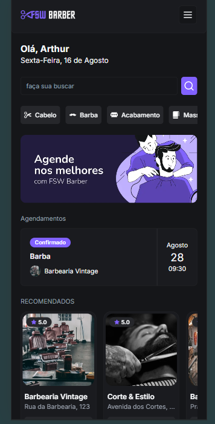
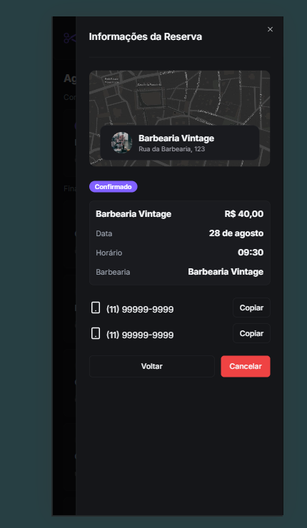

# FSW-Barber

## Ferramentas
- Aplicação usando Next.js
- Usando Tailwindcss
- Usando schad ui

## Rodar o projeto

- primeiro instalar o nodejs versão LTS
- npm install para instalar todas as dependência
- npm run dev

## Projeto Back-end

<a href='https://github.com/Arttanjeiro/fsw-barber-server'>back-end</a>